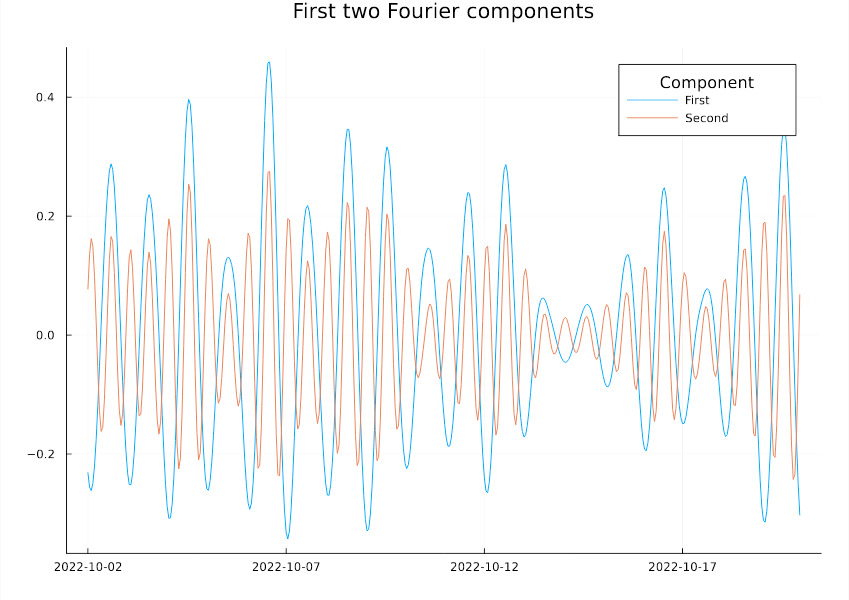
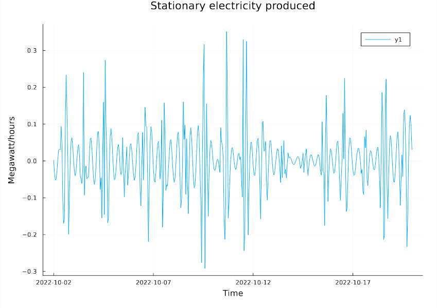

# Solar Forecast

Analyse solar power data and link it to weather variables from (KNMI data)[https://www.knmi.nl/nederland-nu/weer/waarnemingen]. Goal is to forecast production and match with consumption dynamically.

